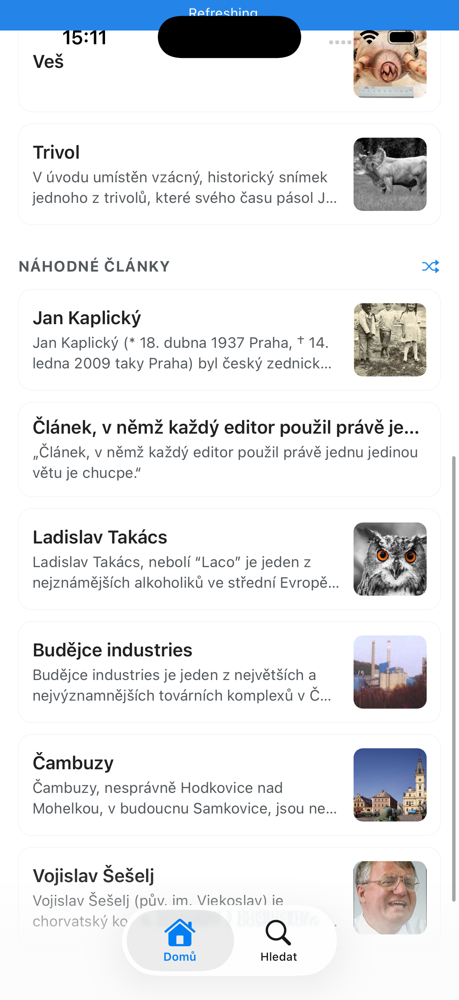
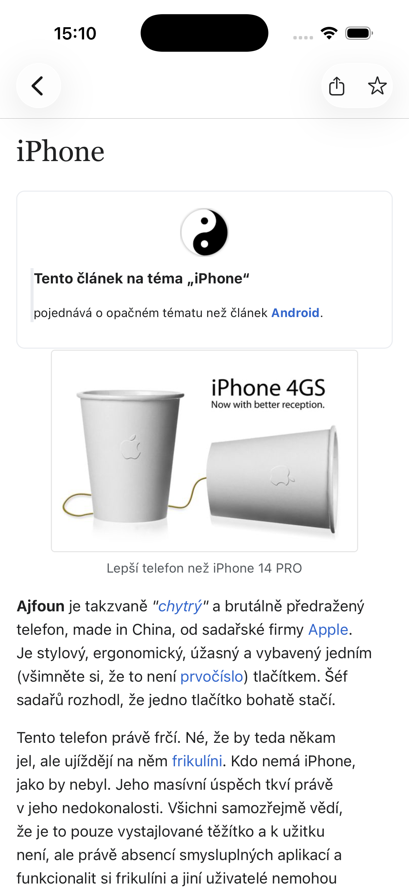

# necyklo

<p align="center">
  
  &nbsp;
  
</p>


Mobilní čtečka pro **[Necyklopedii](https://necyklopedie.org)**, českou [Uncyclopedii](https://en.wikipedia.org/wiki/Uncyclopedia), encyklopedii bez obsahu, kde je každý fakt s láskou nesprávný.

necyklo je postavená na [Expu](https://expo.dev) (React Native) a čte články přímo z **MediaWiki API** Necyklopedie. Žádný vlastní backend tu není, protože backend by jen překážel šíření dezinformací. Vzhled se drží oficiální aplikace Wikipedia, takže se čtenář cítí jako doma, než mu dojde, že je něco hluboce špatně.

## Funkce (MVP)

- Čtení a vyhledávání článků Necyklopedie (našeptávač najde „Liberec", i když napíšeš jen „Libe")
- Nativní vykreslování obsahu ve stylu aplikace Wikipedia: serifové nadpisy, galerie obrázků, sbalitelné infoboxy
- Tmavý (AMOLED) režim, který se řídí nastavením systému
- Oblíbené články, aby ti nesmysly nikdy nebyly dál než jedno ťuknutí

> ⚠️ **Varování:** Při častém užívání slouží jako velmi návyková droga.

## Technologie

- [Expo SDK 56](https://docs.expo.dev/versions/v56.0.0/) · React Native 0.85 · React 19
- [Expo Router](https://docs.expo.dev/router/introduction/) (souborové routování, typované cesty)
- React Compiler
- Zdroj dat: [MediaWiki API Necyklopedie](https://necyklopedie.org/w/api.php)

## Jak začít

Projekt používá [**bun**](https://bun.sh). (To je houska.)

1. Nainstaluj závislosti

   ```bash
   bun install
   ```

2. Spusť vývojový server

   ```bash
   bun start
   ```

   Pak zmáčkni `i` (simulátor iOS), `a` (emulátor Android) nebo `w` (web). Nebo rovnou skoč na cílovou platformu:

   ```bash
   bun run ios       # simulátor iOS
   bun run android   # emulátor Android
   bun run web       # prohlížeč
   ```

Zdrojový kód aplikace žije v `src/app/` (souborové routy Expo Routeru). Architektura a konvence jsou popsané v [CLAUDE.md](./CLAUDE.md); psáno pro roboty, ale můžeš číst s nimi.

## Licence

Viz [LICENSE](./LICENSE). Stejně jako Necyklopedii samotnou ber i tohle na vlastní nebezpečí.
